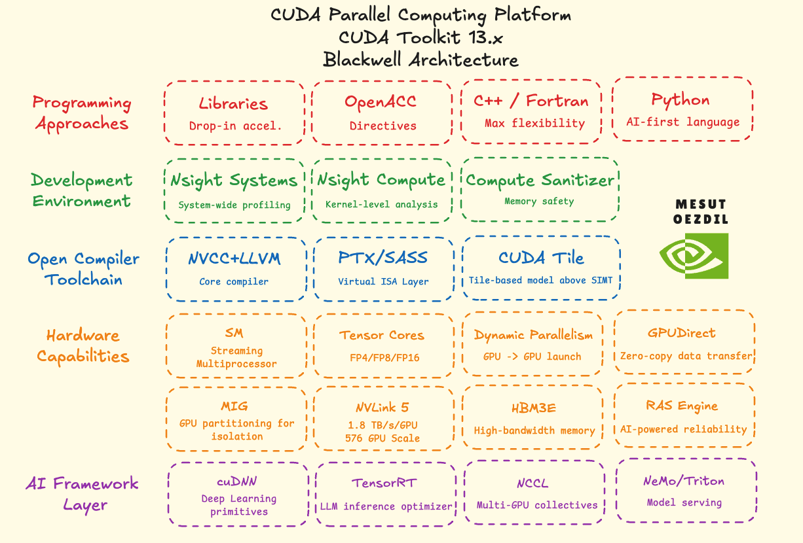

# Lesson 05: The CUDA Platform Stack

The diagram shows the full CUDA platform as it ships with Toolkit 13.x for Blackwell. There are five layers: languages at the top, hardware at the bottom, and tools in between.

## Programming languages

CUDA C/C++ is the main language for writing kernels. It is what all previous lessons have used. OpenACC and CUDA Fortran let you add GPU support through code annotations instead of writing kernels by hand. Python reaches the GPU through libraries like CuPy and Numba. All four approaches end up running on the same GPU hardware.

## Development tools

Nsight Systems records a timeline of what the CPU and GPU are doing. You use it to find where time is being spent in the application. Nsight Compute focuses on a single kernel and shows how well it uses the hardware. Compute Sanitizer runs the program and reports memory errors inside kernels.

## Compiler toolchain

`nvcc` compiles `.cu` files. It sends host code to the regular C++ compiler and device code to the NVIDIA compiler. Device code first compiles to PTX, a virtual instruction set not tied to any specific GPU. The GPU driver then converts PTX to SASS, the real instructions for that GPU. Because PTX is stored in the binary, the same program can run on future GPUs without being recompiled.

## Hardware capabilities

Tensor Cores are hardware units inside each SM built for matrix math. They run FP16 and FP8 matrix multiplications much faster than regular FP32 cores. MIG splits one GPU into up to seven independent partitions, each acting like a separate GPU. Dynamic Parallelism lets a running kernel launch another kernel from the GPU without going back to the CPU. GPU Direct lets GPUs send data to each other or to a network card directly, without going through system memory.

## AI framework layer

cuDNN is a library of GPU-accelerated operations used in deep learning. PyTorch and TensorFlow call it for convolutions, attention, and similar operations. TensorRT takes a trained model and optimizes it to run fast on a specific GPU. NCCL handles communication between multiple GPUs, which is needed for training across more than one GPU at a time.

## Visual

## Glossary

- PTX (Parallel Thread Execution): the intermediate instruction set CUDA compiles device code to first. Not tied to any specific GPU. The driver converts it to real GPU instructions at runtime.
- SASS (Streaming ASSembler): the real machine code for a specific GPU. PTX gets converted to SASS before it runs.
- `nvcc`: the CUDA compiler. Handles both host and device code in the same `.cu` file.
- Nsight Systems: profiler that shows a timeline of CPU and GPU activity for the full application.
- Nsight Compute: profiler that measures how well a single kernel uses the GPU hardware.
- Compute Sanitizer: tool that detects memory errors inside kernels while the program runs.
- MIG (Multi-Instance GPU): splits one physical GPU into isolated partitions. Each partition acts as its own GPU.
- Tensor Core: dedicated matrix-multiply unit inside each SM. Faster than regular FP32 cores for matrix operations.
- Dynamic Parallelism: a kernel on the GPU can launch another kernel without returning to the CPU.
- GPU Direct: lets GPUs transfer data to each other or to a network card without going through the CPU.
- NCCL: library for communication between multiple GPUs. Used for distributed training.
- cuDNN: library of GPU operations for deep learning. Used by PyTorch and TensorFlow under the hood.
- TensorRT: optimizes a trained model to run fast on a specific GPU.
